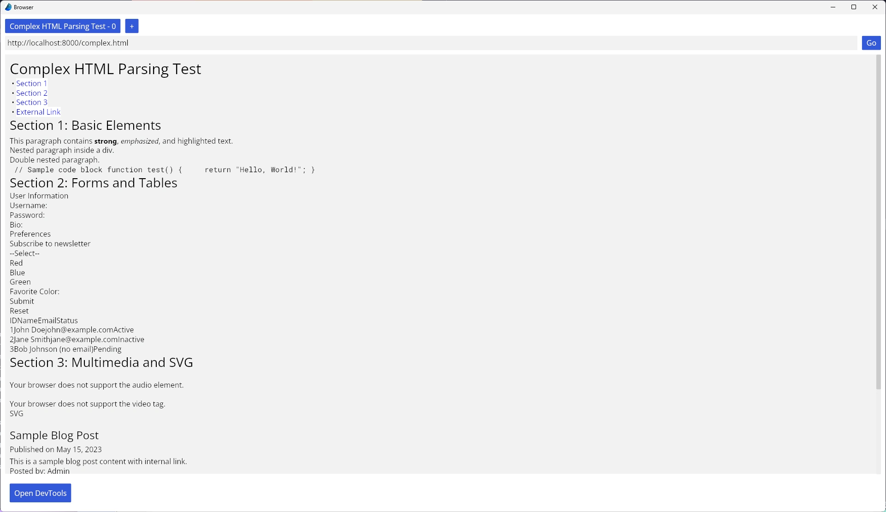

# Rust powered Browser

A browser (kinda) project to learn Rust, creating and displaying HTML content via a UI, mostly from scratch. Perhaps I can use CSS and hopefully JS (in the future 😶). Not aiming to be fully HTML5 spec compliant just enough to display simple content.

## Features
- [ ] Engine
  - [ ] Delegate tasks
  - [x] Multithreaded?
  - [ ] Event queue
- [x] HTML Parser
  - [x] Basic DOM-tree builder
  - [x] Handling malformed tags
  - [x] Parses a decent amount of .html files correctly
  - [ ] Handling of more exceptions
- [ ] CSS Parser
  - [ ] Basic CSSOM builder
  - [ ] Cascading support
- [x] UI rendered
  - [x] Rendering the DOM-tree
  - [x] Applying basic CSS
  - [x] Drawing images
- [ ] Networking
  - [x] Able to fetch a single .html file from a URL
  - [x] Handling of Content-Security-Policy header
  - [ ] Handle POST, PUT, PATCH, DELETE, and other methods

## Preview

## License

This project is licensed under the MIT License - see the [LICENSE](LICENSE) file for details.
