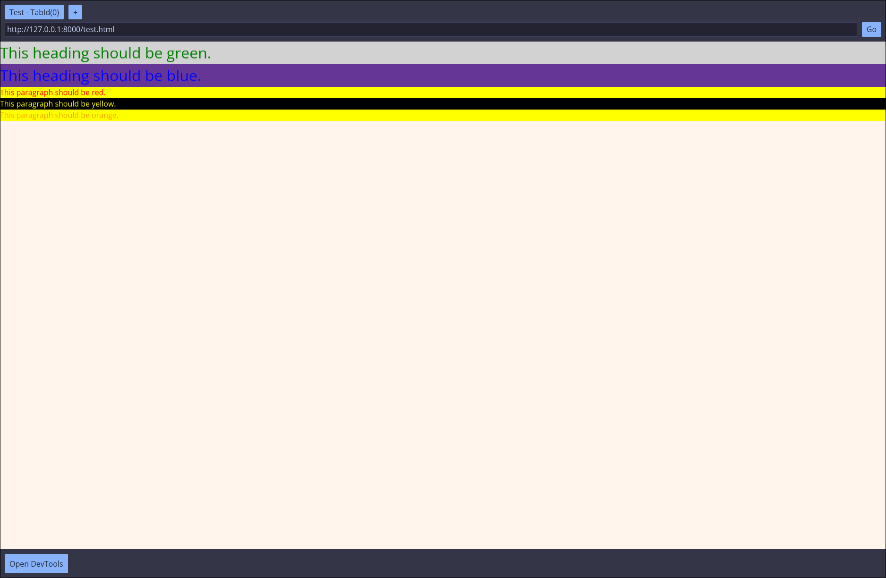

# Rust Browser

A from-scratch (sort of) web browser built in Rust! It supports basic HTML and CSS rendering, as well as UI elements like tabs. The goal of this project is to learn more about how browsers work under the hood and to improve my Rust skills, as such it contains minimal dependencies as to not rely on external libraries for core functionality.

> [!WARNING]
> This is a work in progress and is not intended for production use. It is missing many features and is not optimized for performance or security.

## Preview

[HTML file used for the preview](./docs/preview.html)



## How to Run

1. Install Rust (https://www.rust-lang.org/tools/install)
2. Run

```sh
$ cargo run
```

## Testing

To run the tests, use the following command:

```sh
$ cargo test
```

## License

This project is licensed under the MIT License - see the [LICENSE](LICENSE) file for details.
