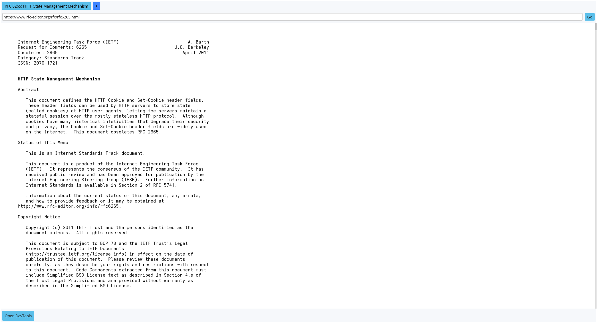
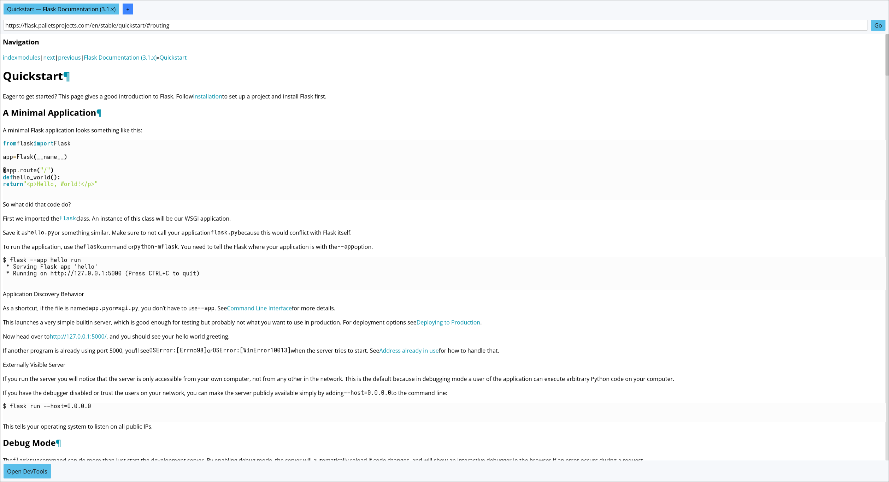
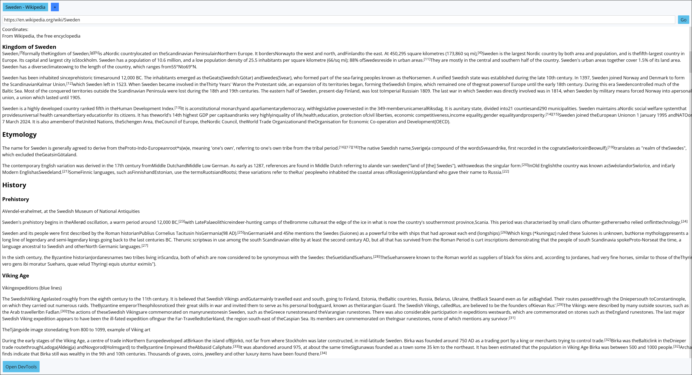
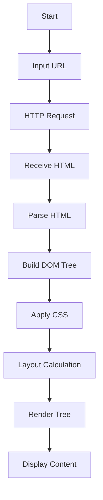

# Rust Browser

A web browser built in Rust! It currently supports a subset of HTML and CSS when rendering, as well as UI elements like tabs. The goal of this project is to learn more about how browsers work under the hood and to improve my Rust skills, as such it contains a few dependencies but is otherwise built from scratch.

> [!WARNING]
> This is a work in progress and is not intended for production use. It is missing many features and is not optimized for performance or security.

## Features

- HTML & CSS parsing
- Layout Engine, CSS properties supported can be found: [./docs/CSS.md](./docs/CSS.md).
- Rendering Engine using `wgpu` and `iced` for UI elements.
- Headless mode
- Navigating to URLs
- Cookies
- UI theming with user configurable TOML file
- Tabbed browsing

## Screenshots

https://www.rfc-editor.org/rfc/rfc6265.html



https://flask.palletsprojects.com/en/stable/quickstart/#routing



https://en.wikipedia.org/wiki/Sweden



## Architecture

The browser is composed of 7 subsystems, each responsible for a specific aspect of the browser's functionality.

### Subsystems

- [**HTTP Client**](./crates/network): Responsible for making HTTP requests and handling responses.
- [**HTML Parser**](./crates/html-parser): Parses HTML documents and builds the DOM tree.
  - [**Tokenizer**](./crates/html-tokenizer): Breaks HTML into tokens.
  - [**DOM Builder**](./crates/html-dom): Builds the DOM tree from tokens.
- [**CSS Parser**](./crates/css-parser): Parses CSS stylesheets and builds the CSSOM.
  - [**Tokenizer**](./crates/css-tokenizer): Breaks CSS into tokens.
  - [**CSSOM Builder**](./crates/css-cssom): Builds the CSS Object Model from tokens.
- [**Layout Engine**](./crates/layout): Generates the layout tree based on the DOM and style tree.
  - [**Selector Generation**](./crates/css-selectors): Converts CSSOM to selectors that can be applied to the DOM.
  - [**Styletree Builder**](./crates/css-style): Combines CSS selectors, and DOM to create the style tree.
- [**Rendering Engine**](./crates/renderer): Renders the layout tree to the screen using GPU acceleration.
- [**Browser Core**](./crates/browser-core): Manages the overall browser state, including tabs, and cookies.
- [**UI Layer**](./crates/ui): Manages the user interface elements like tabs, address bar, etc.

### Flowchart

The following flowchart illustrates the high-level process of how the browser handles a URL request:



## Non-Goals (for now)

- JavaScript support
- Advanced CSS features (animations, flexbox, grid, etc.)
- Advanced security features (sandboxing, etc.)
- Extensions or plugins
- Spec compliance with all web standards

## How to Run

1. Install Rust (https://www.rust-lang.org/tools/install)
2. Run

```sh
# Standard mode
$ cargo run

# Help for command line options
$ cargo run -- --help

# Headless mode
$ cargo run -- --headless

# Start with a specific URL
$ cargo run -- --url http://localhost:5000/preview.html
```

## Testing

The project includes unit tests for many subsystems. To run the tests, use the following command:

```sh
$ cargo test

# Specific crate tests
$ cargo test -p <crate-name>
```

## Dependencies

This project intentionally uses a limited set of dependencies, the goal for this project is to minimize relying on external libraries for core functionality, but I am also realistic about what can be achieved in a reasonable timeframe.

### Rust Crate Dependencies

Rust crates dependencies are chosen based on the following criteria:

- Essential functionality that would be impractical to implement from scratch and is out of scope for this project (e.g., `wgpu` for GPU rendering).
- Development and testing tools that do not impact the core functionality of the browser (e.g., `tracing` for logging).
- Libraries that would force me to work extensively on other aspects that isn't browser related (e.g., `serde` for serialization/deserialization).
- Temporary dependencies that facilitate developer velocity, these fall into two sub-categories:
  - Dependencies that will be replaced by a lower-level dependency eventually (e.g., `reqwest` for HTTP requests, which could eventually be replaced by `curl`/`libcurl`).
  - Dependencies that come from another dependency but are used for convenience and will be removed when that dependency is removed (e.g., `cosmic-text` for text shaping, which is a dependency of `iced`).

To generate the most up-to-date list, run the [gen_third_party.py](./tools/gen_third_party.py) script and/or refer to the [Cargo.toml](./Cargo.toml) file and each individual subsystem crate's Cargo.toml, e.g., [crates/errors/Cargo.toml](./crates/errors/Cargo.toml).

### External

This project relies on some external tools and libraries, these are not dependencies of the browser itself but are used to facilitate development and testing.

- [Python 3](https://www.python.org/downloads/) - Required to run the Flask server and other scripts.
- [Flask](https://flask.palletsprojects.com/en/stable/) - Used for serving test HTML files, allows us to test internal functionality outside of rendering such as cookies, headers, etc.

### Fonts

We have fallback fonts to ensure that the browser can always render text properly, these can be found in: [./assets/font](./assets/font), licenses for these fonts can be found in [FONTS.md](FONTS.md).

Currently included fonts:

- OpenSans (SIL Open Font License)
- Roboto Mono (SIL Open Font License)

## License

This project is licensed under the MIT License - see the [LICENSE](LICENSE) file for details.
