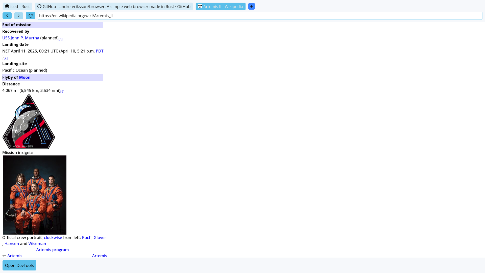

# Rust Browser

This is a mostly from-scratch browser built in Rust.

It currently supports a subset of HTML and CSS when rendering, and does **not support JavaScript**.

> [!WARNING]
> It is not intended to be a production-ready browser and should not be used as such.

## Features

- Headless mode
- URL Navigation
- Cookies
- UI theming with user configurable TOML file, see [./docs/theme.md](./docs/theme.md) for more details
- Tabs and basic tab management (open, close, switch)
- In-memory history of visited pages for each tab

### Extra

Supported CSS properties can be found: [./docs/CSS.md](./docs/CSS.md).

## Screenshot



## Architecture

The browser is composed of 7 subsystems, each responsible for a specific aspect of the browser's functionality.

### Subsystems

- [**IO Subsystem**](./crates/io): Responsible for handling all input/output operations, including file system access and network communication.
  - [**HTTP Client**](./crates/network): Responsible for making HTTP requests and handling responses.
- [**HTML Parser**](./crates/html-parser): Parses HTML documents and builds the DOM tree.
  - [**Tokenizer**](./crates/html-tokenizer): Breaks HTML into tokens.
  - [**DOM Builder**](./crates/html-dom): Builds the DOM tree from tokens.
- [**CSS Parser**](./crates/css-parser): Parses CSS stylesheets and builds the CSSOM.
  - [**Tokenizer**](./crates/css-tokenizer): Breaks CSS into tokens.
  - [**CSSOM Builder**](./crates/css-cssom): Builds the CSS Object Model from tokens.
- [**Layout Engine**](./crates/layout): Generates the layout tree based on the DOM and style tree.
  - [**Selector Generation**](./crates/css-selectors): Converts CSSOM to selectors that can be applied to the DOM.
  - [**Style Tree Builder**](./crates/css-style): Combines CSS selectors, and DOM to create the style tree.
- [**Rendering Engine**](./crates/renderer): Renders the layout tree to the screen via the GPU using `wgpu`.
- [**Browser Core**](./crates/browser-core): Manages the overall browser state, including tabs, navigation, and communication between subsystems.
- **Interface Layer**: The browser currently has two interfaces, a graphical user interface and a headless mode, these are built on top of the browser core.
  - [**UI**](./crates/browser-ui): Provides a graphical user interface for the browser, built using Iced, a Rust GUI library.
  - [**Headless**](./crates/browser-headless): Provides a headless (terminal) mode for the browser, allowing it to run without a graphical interface.

## Planned Features

- History management & file-backed history
- Bookmarks
- Download manager
- Form handling

## Non-Goals (for now)

- JavaScript support
- Advanced CSS features (animations, flexbox, grid, etc.)
- Advanced security features (sandboxing, etc.)
- Extensions or plugins
- Spec compliance with all web standards

## How to Run

1. Install Rust (https://www.rust-lang.org/tools/install)
2. Run the browser using Cargo, the Rust package manager.

### Standard UI Mode

```sh
cargo run
```

### Show help

```sh
cargo run -- --help
```

### Headless Mode

To run the browser in headless mode, use the following command:

```sh
cargo run -- --headless
```

You can even specify commands to run in a one-shot manner, for example to navigate to a URL and then print the DOM tree:

```sh
cargo run -- --headless --url "https://www.google.com/" --command "body"
```

## Testing

The project includes unit tests for many subsystems. To run the tests, use the following command:

```sh
cargo test
```

### Specific Subsystem

To run tests for a specific subsystem, navigate to that subsystem's crate and run the tests from there. For example, to run tests for the layout engine:

```sh
cargo test -p layout
```

## Dependencies

This project intentionally uses a limited set of dependencies, the goal for this project is to minimize relying on external libraries for core functionality, but I am also realistic about what can be achieved in a reasonable timeframe.

### Rust Crate Dependencies

Rust crates dependencies are chosen based on the following criteria:

- Essential functionality that would be impractical to implement from scratch and is out of scope for this project (e.g., `wgpu` for GPU rendering).
- Development and testing tools that do not impact the core functionality of the browser (e.g., `tracing` for logging).
- Libraries that would force me to work extensively on other aspects that isn't browser related (e.g., `serde` for serialization/deserialization).
- Temporary dependencies that facilitate developer velocity, these fall into two sub-categories:
  - Dependencies that will be replaced by a lower-level dependency eventually (e.g., `reqwest` for HTTP requests, which could eventually be replaced by `curl`/`libcurl`).
  - Dependencies that come from another dependency but are used for convenience and can be removed when that dependency is removed (e.g., `cosmic-text` for text shaping, which is a dependency of `iced`).

To generate the most up-to-date list, run the [gen_third_party.py](./tools/gen_third_party.py) script and/or refer to the [Cargo.toml](./Cargo.toml) file and each individual subsystem crate's Cargo.toml, e.g., [crates/errors/Cargo.toml](./crates/errors/Cargo.toml).

### External

This project utilizes some external tools and libraries, these are not dependencies of the browser itself but are used to facilitate development and testing.

- [Python 3](https://www.python.org/downloads/) - Required to run the Flask server and other scripts.
- [Flask](https://flask.palletsprojects.com/en/stable/) - Used for serving test HTML files, allows us to test internal functionality outside of rendering such as cookies, headers, etc.

### Fonts

We have fallback fonts to ensure that the browser can always render text properly, these can be found in: [./assets/font](./assets/font), licenses for these fonts can be found in [FONTS.md](./docs/license/FONTS.md).

Currently included fonts:

- OpenSans (SIL Open Font License)
- Roboto Mono (SIL Open Font License)
- Roboto Serif (SIL Open Font License)

### Icons

SVG Icons used in the UI are sourced from [Lucide](https://lucide.dev/) and are licensed under the [ISC License](https://lucide.dev/license), the license can be found in [ICONS.md](./docs/license/ICONS.md).

## License

This project is licensed under the MIT License - see the [LICENSE](LICENSE) file for details.
